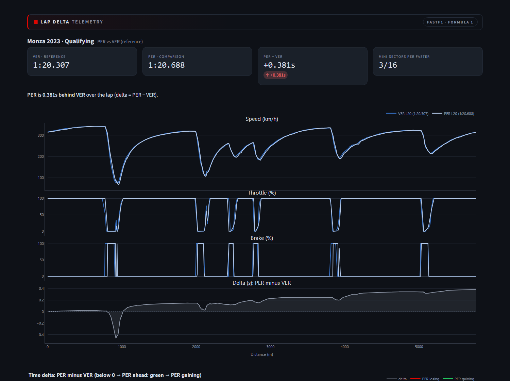
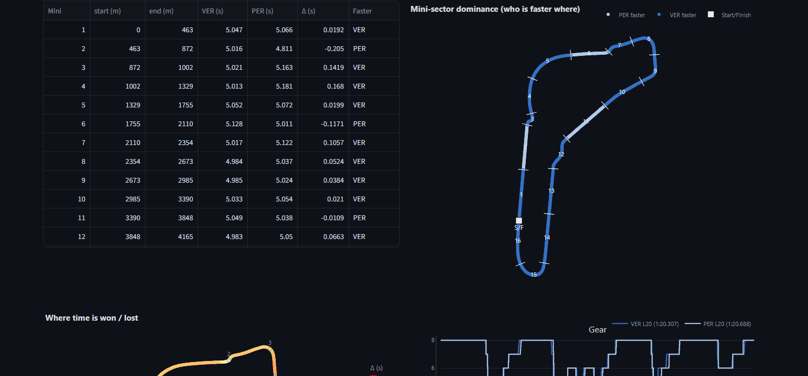

# 🏁 Lap Delta Analyzer

Distance-domain lap-time **delta analysis** for motorsport telemetry. Compare two laps
and see *exactly where and why* time is won or lost — synced Speed/Throttle/Brake/Delta
traces, a delta-colored track map, and a ranked, corner-by-corner table with
plain-English coaching hints.

Built on **real Formula 1 telemetry** via [FastF1](https://docs.fastf1.dev) **and real
iRacing `.ibt`** sim telemetry via [pyirsdk](https://github.com/kutu/pyirsdk), behind a
source-agnostic schema + adapter boundary — the same analysis and the same dashboard serve
both sources, and the iRacing page differs only in how you load the file.

> **Why this design?** Every analysis module is written once against a single canonical
> `Lap` schema. FastF1 got the whole tool working end-to-end on real data; the iRacing
> adapter (Milestone 7) just maps `.ibt` channels into the same schema and reuses the entire
> pipeline — no changes to analysis, viz, or the dashboard.

---

## Demo

Two laps compared in the distance domain: Verstappen vs. Pérez, **Monza 2023 Qualifying**
(+0.381 s over the lap).



Mini-sector **dominance** on the real circuit (who is faster where), with the delta table
that reconciles to the overall gap:



> **Live demo:** deploy to Streamlit Community Cloud in ~2 minutes (see
> [Deploy a live demo](#deploy-a-live-demo-streamlit-community-cloud)), then drop the URL here.

---

## What it does

- **Ingest** real F1 car + position telemetry by year / event / session / driver.
- **Normalize** every source into one metric/SI schema (`distance_m`, `time_s`,
  `speed_kph`, `throttle`, `brake`, `gear`, `rpm`, `x`, `y`).
- **Align** two laps on a common distance grid and compute the **cumulative time delta**
  (the standard race-engineering "delta-vs-distance").
- **Detect corners** from speed minima (+ track curvature from x/y) and extract per-corner
  **brake point**, **minimum speed**, **throttle-on point**, and **time lost/gained**.
- **Coach**: rule-based, plain-English suggestions ranked by time lost.
- **Dashboard**: interactive Streamlit app with a metric ⇄ imperial toggle.

---

## Architecture

```
                 ┌─────────────────┐
  FastF1  ─────▶ │                 │
  (F1 API)       │  TelemetryAdapter│──▶  canonical Lap  ──▶  laps ─▶ align ─▶ corners
  iRacing .ibt ▶ │   (schema map)   │      (DataFrame +           (M2)   (M3)     (M4)
  (pyirsdk IBT)  │                 │       LapMeta)                 │
                 └─────────────────┘                               ▼
                                                     coaching (M5) ─▶ viz ─▶ Streamlit app
```

- `src/lap_delta/schema.py` — the canonical `Lap`/`LapMeta` contract + `validate_schema`.
- `src/lap_delta/adapters/` — `FastF1Adapter` and `IracingIbtAdapter` (both built).
- `src/lap_delta/{laps,align,corners,coaching,viz}.py` — source-agnostic analysis + charts.
- `app.py` — the Streamlit dashboard: two pages (FastF1 / iRacing) over one shared render.
- `tests/` — schema, delta math, lap filtering, corner detection, iRacing split/mapping
  (synthetic fixtures) + gated end-to-end tests against real FastF1 and real `.ibt` data.

See [`plan.md`](plan.md) for the full milestone plan and [`plan_m7.md`](plan_m7.md) for the
iRacing adapter design + build notes.

---

## Quick start

```bash
python -m venv .venv
# Windows:  .venv\Scripts\activate     |     macOS/Linux:  source .venv/bin/activate
pip install -e ".[dev]"

# Run the dashboard (first F1 load downloads + caches telemetry; needs internet once)
streamlit run app.py

# Run the tests (offline; uses synthetic fixtures)
pytest -m "not network"

# Run the real FastF1 end-to-end test (downloads Monza 2023 Q)
LAPDELTA_E2E=1 pytest -m network

# Run the real .ibt end-to-end test (drop any .ibt into data/sample/ first)
pytest -m iracing
```

**FastF1 page** default view: **2023 Italian GP (Monza) Qualifying — Pérez vs. Verstappen**.

**iRacing page:** upload your own iRacing `.ibt` telemetry export (any practice / qualifying /
race session). The continuous stream is split into laps at start/finish crossings and you
compare any two — same traces, sectors, dominance map and coaching as the FastF1 page.
`pyirsdk` is a core dependency, so it works out of the box.

### Deploy a live demo (Streamlit Community Cloud)

1. Push this repo to GitHub.
2. Go to [share.streamlit.io](https://share.streamlit.io), sign in with GitHub, click **New app**.
3. Select this repo, branch `main`, main file `app.py`, and **Deploy**.

`requirements.txt` already lists every dependency, so the build runs as-is. The **FastF1 page**
works on the hosted server (it has internet and caches after the first load); the **iRacing page**
takes an uploaded `.ibt`. Paste the resulting `https://<app>.streamlit.app` URL into the Demo
section above.

---

## Example finding

Comparing **teammates** (same car ⇒ the delta is almost purely *driver*), a typical read
from Monza 2023 Qualifying:

> *"Pérez loses ≈0.3 s to Verstappen through the second chicane — brakes ~10 m earlier
> and returns to throttle later, carrying less minimum speed."*

_(Screenshots / GIF: add `docs/` images after running locally.)_

---

## Methodology notes

- **Delta:** both laps are resampled onto a shared distance grid; delta(d) =
  `t_cmp(d) − t_ref(d)`. The end-of-lap delta equals the lap-time difference (unit-tested).
- **Corners:** corners are speed minima reinforced by curvature from the x/y trace, with
  windows bounded by midpoints between apexes (robust to flat straights) — source-agnostic,
  so it works identically on F1 and iRacing laps.
- **iRacing `.ibt`:** one continuous stream is split into laps at `LapDistPct` start/finish
  wraparounds; `Lat/Lon` is projected to a local x/y track map; brake is **continuous
  pressure** (not FastF1's on/off). A flying lap must cover the whole track and never drop
  near-stationary, which cleanly excludes standing starts, pit and out/in laps.
- **Units:** the schema is always metric/SI; imperial is a display-time toggle only.

---

## Roadmap

- [x] M0–M6: FastF1 end-to-end — schema, adapter, delta, corners, dashboard, tests.
- [x] **M7:** `IracingIbtAdapter` via `pyirsdk` `IBT` — `.ibt` → same schema, same pipeline,
  same dashboard (with continuous brake pressure). Two-page Streamlit app + pit-wall theme.
- [ ] Optional: N-lap overlay, optional `lat_accel`/`long_accel` channels, public hosted demo.

## License

MIT
